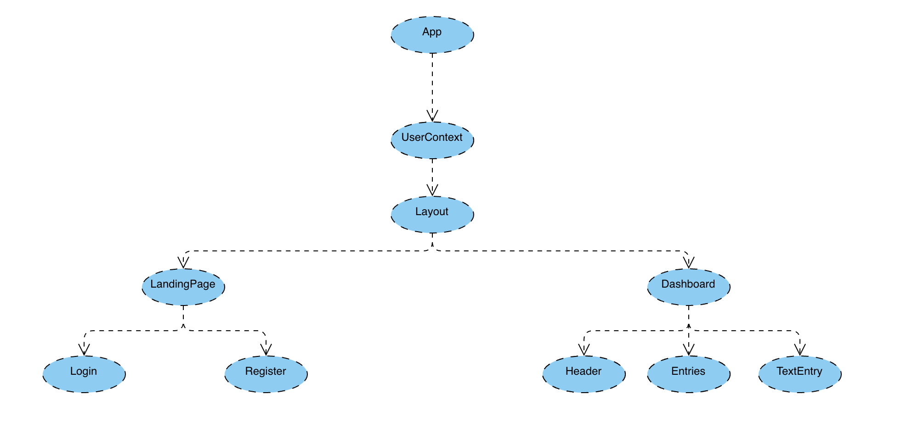

# Dear Diary

### By Sarah Reimann


## Description

A digital journal. Users can log in and create entries that become populated to their personal dashboard. Contains full CRUD functionality. Backend built with C# and a MySQL database. Back end source code can be found here: [Dear Diary API](https://github.com/reimannsarah/DoJourAPI.Solution)

## Component Diagram


## Technologies Used
* _React_
* _React Framer Motion_
* _TypeScript_
* _JSX_
* _Node.js_

## Component Diagram


## Setup/Installation Instructions
1. Clone this repo to your desktop
2. Open your terminal (e.g. Terminal of Gitbash) and navigate to this project's directory, "Journo".
3. Run ```npm install``` in the project's root directory to install necessary dependencies.
4. Run ```npm start``` in the project's root directory to start the app

## Known Bugs
* None
